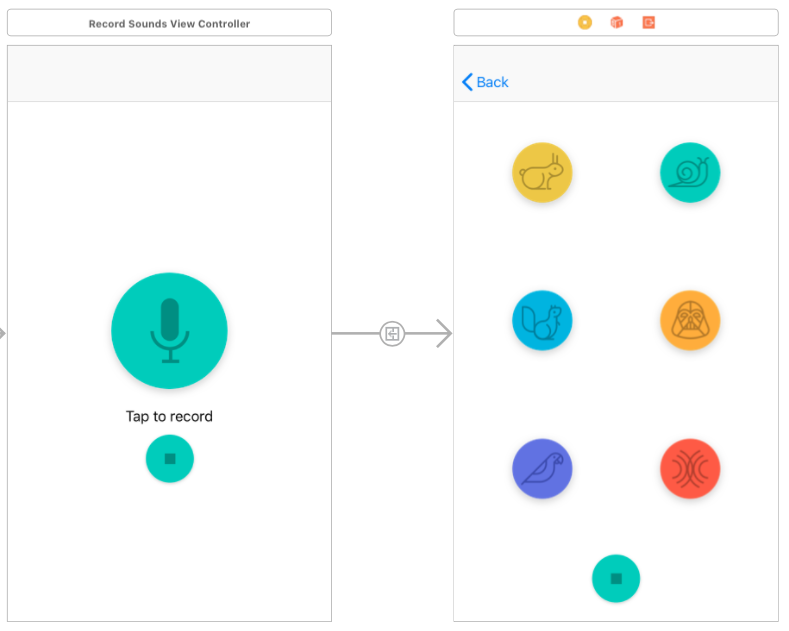

# pitch-perfect
iOS app to play with voice recordings.

Uses the AVAudioEngine and AVFoundation frameworks to implement the following voice effects:

* Fast voice
* Slow voice
* High pitch
* Low pitch
* Reverb
* Echo

## Storyboard

